# Rick and Morty Mobile App

## 📱 Project Overview

This repository contains a mobile application built with **Python**, **Kivy**, and **KivyMD**, integrating the **Rick and Morty API** to deliver an engaging user experience. The app features a modern, **responsive**, and **intuitive** interface for exploring characters from the Rick and Morty universe, managing user accounts, and saving favorite characters.

The goal is to provide a seamless and visually appealing mobile experience for fans to browse characters, view details, and manage their favorites with ease.

## 📷 Preview

|                   | Login                                        | Register                                           | Characters                                             | Character detail                                                   | Nav Drawer                                     | Favorites                                            |
| ----------------- | -------------------------------------------- | -------------------------------------------------- | ------------------------------------------------------ | ------------------------------------------------------------------ | ---------------------------------------------- | ---------------------------------------------------- |
| kivymd-2.0.1.dev0 | 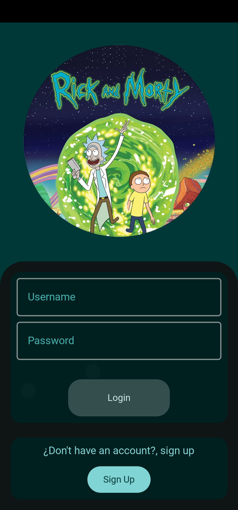   | 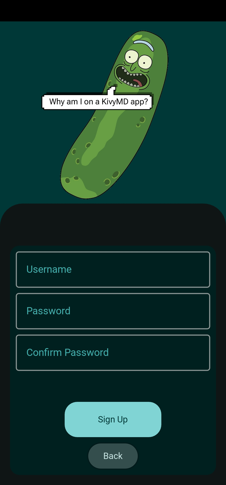   | 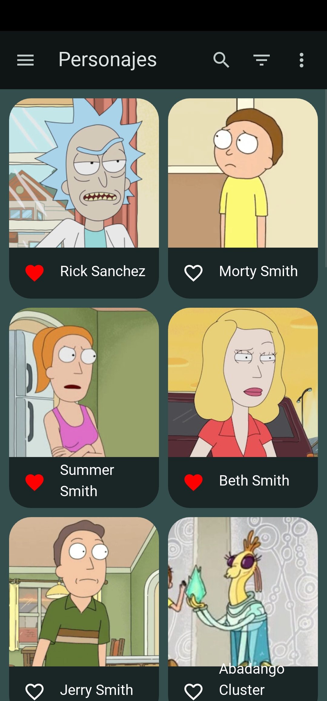   | 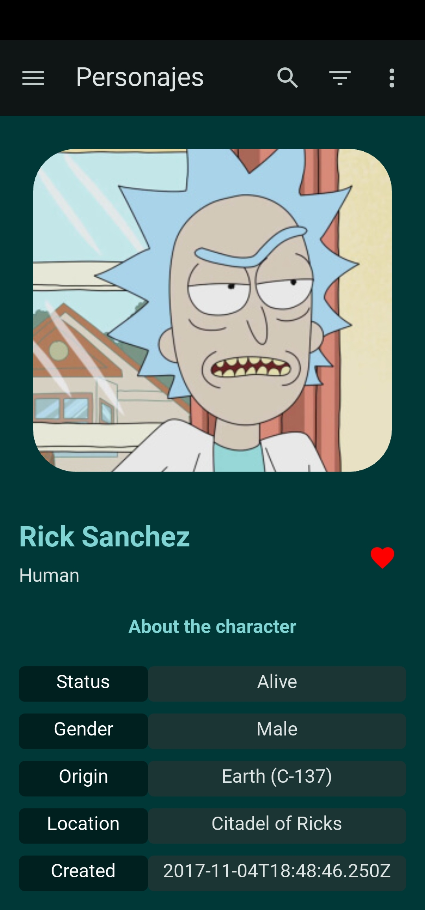   | 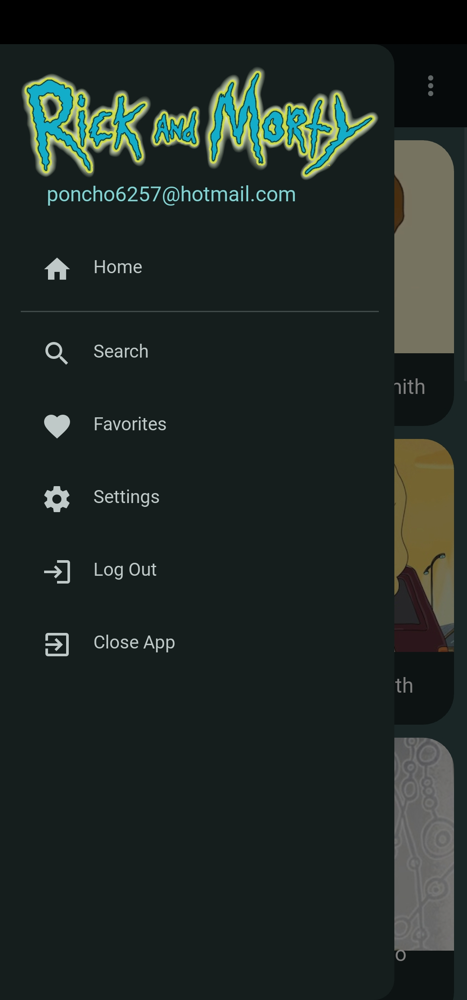   | 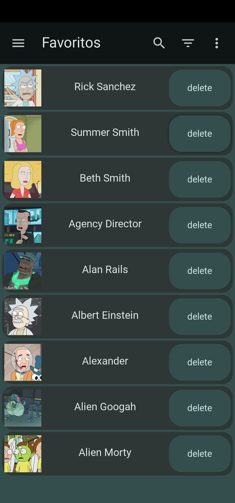   |
| kivymd-1.1.1      | 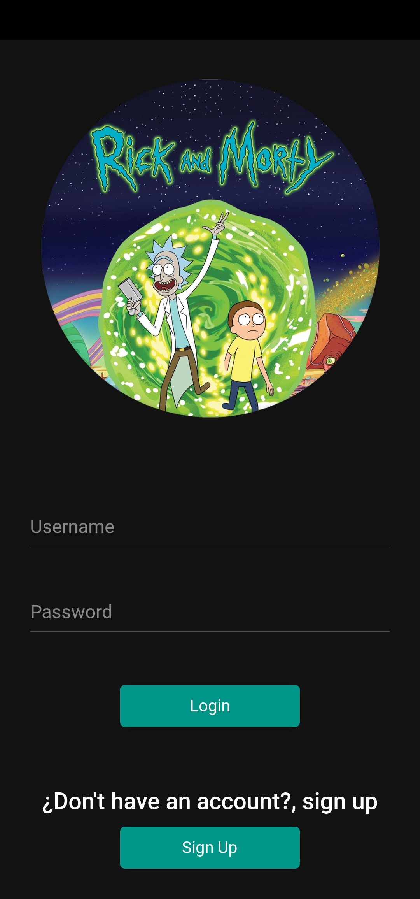 | 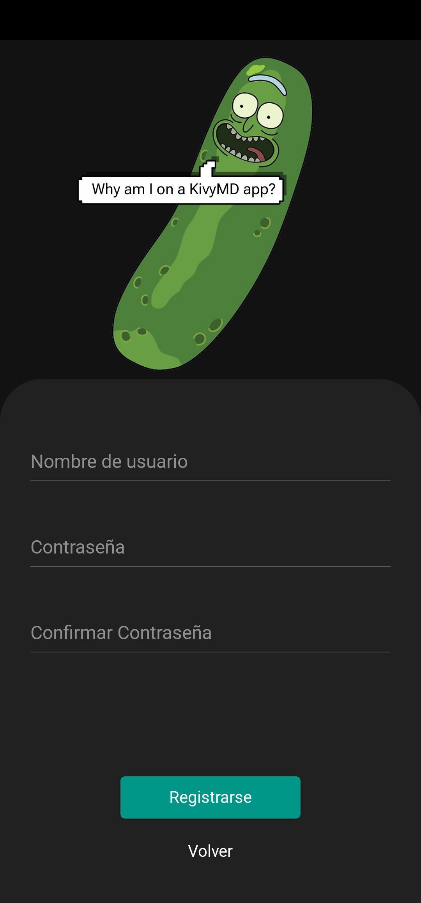 | 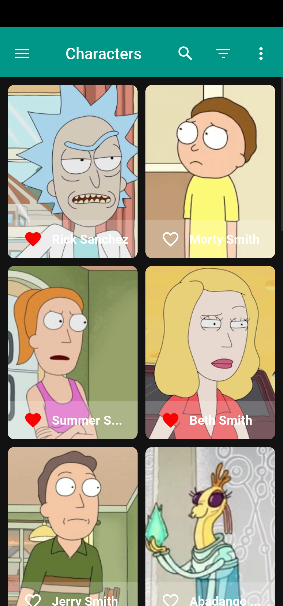 | 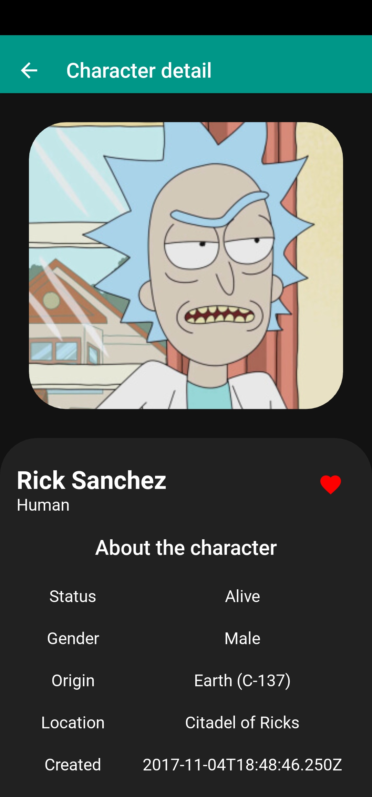 | 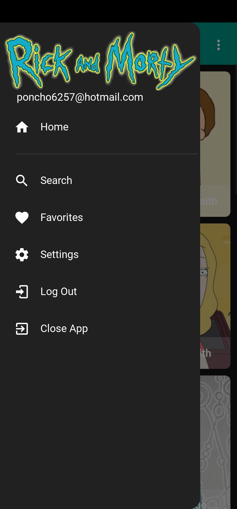 | 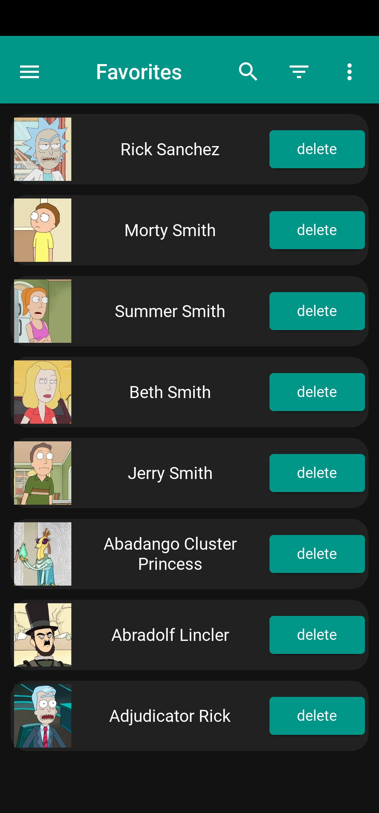 |

## ✨ Features

- **Login and Registration Screens**: Secure user authentication for personalized access.
- **Character Browser**: Displays a list of characters fetched from the Rick and Morty API with details like name, species, and status.
- **Favorites Screen**: Allows users to save and view their favorite characters.
- **Navigation Bar**: Intuitive navbar for easy access to all app sections.
- **Responsive UI**: Built with KivyMD for a modern, Material Design-inspired interface that works across Android, iOS, and desktop.

## 🧰 Technologies Used

- **Python**: Core language.
- **Kivy**: Cross-platform framework for building the app's UI.
- **KivyMD(2.0.1.dev0, 1.1.1)**: Material Design components for a polished and modern look.
- **Rick and Morty API**: External API for fetching character data.
- **Requests**: Python library for handling API calls.

## 🚀 Getting Started

### Prerequisites

- Python 3.8+
- Kivy and KivyMD installed
- Internet connection for API requests

### 🛠️ Installation Guide

To run the project locally:

### 1. Clone the repository

```bash
git clone https://github.com/LCPallares/KivyMD-RickAndMorty.git
```

### 2. Navigate to the project directory

```bash
cd KivyMD-RickAndMorty
```

### 3. Create a virtual environment (recommended)

```bash
python -m venv venv
```

### 4. Activate the virtual environment

- On **Windows**:
  
  ```bash
  .env\Scripts\activate
  ```

- On **macOS / Linux**:
  
  ```bash
  source venv/bin/activate
  ```

### 5. Install Kivy (latest pre-release)

```bash
pip install "kivy[full]" --pre --extra-index-url https://kivy.org/downloads/simple/
```

### 6. Install KivyMD (from GitHub)

```bash
pip install "https://github.com/kivymd/KivyMD/archive/master.zip#egg=kivymd&subdirectory=kivymd"
```

### 🚀 How to Run the App

Once setup is complete:

```bash
python main.py
```

> 🔁 Replace `main.py` with your actual main script if different (e.g., `app.py`)

### API Setup

The app uses the [Rick and Morty API](https://rickandmortyapi.com/). No API key is required, but ensure an active internet connection for data fetching.

## 📂 Project Structure

```markdown
rickmorty_app/
├── main.py
├── assets/
│   ├── fonts/
│   │   ├── font1
│   │   └── font2
│   └── images/
│       ├── logo.svg
│       ├── icon.png
│       └── placeholder.png
├── components/
│   ├── character_tile.py
│   └── character_tile.kv
├── controllers/
│   ├── auth_controller.py
│   ├── character_controller.py
│   └── favorites_controller.py
├── models/
│   ├── user_model.py
│   ├── favorite_model.py
│   └── database.py
├── views/
│   ├── auth/
│   │   ├── login.kv
│   │   ├── login.py
│   │   ├── register.kv
│   │   └── register.py
│   ├── characters/
│   │   ├── characters_list.kv
│   │   ├── characters_list.py
│   │   ├── character_detail.kv
│   │   └── character_detail.py
│   └── favorites/
│       ├── favorites_list.kv
│       └── favorites_list.py
└── utils/
    ├── api_client.py
    └── helpers.py
```

## 🤝 Contributing

Contributions are welcome! To contribute:

1. Fork the repository.
2. Create a new branch (`git checkout -b feature-name`).
3. Make your changes and commit (`git commit -m 'Add feature'`).
4. Push to the branch (`git push origin feature-name`).
5. Open a pull request.

## 📝 License

This project is licensed under the MIT License. See the [LICENSE](LICENSE) file for details.

## 🙌 Acknowledgments

- [Rick and Morty API](https://rickandmortyapi.com/) for providing the character data.
- [Kivy](https://kivy.org/) and [KivyMD](https://kivymd.readthedocs.io/) communities for their amazing frameworks.
- Inspired by the vibrant Rick and Morty fanbase!